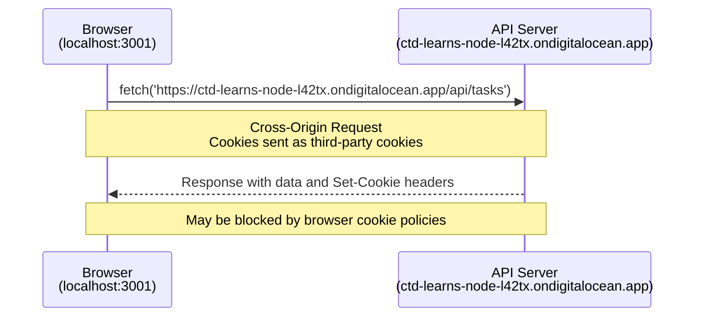
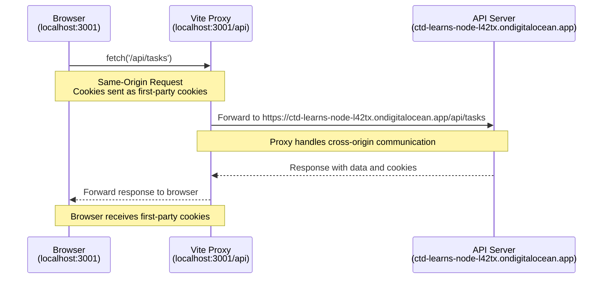

# Alternative Setup: Using Vite Proxy to Avoid Third-Party Cookie Issues

## Overview

This supplemental guide provides an alternative setup for the React todo application that eliminates the need for third-party cookies. Some users have browsers configured to block third-party cookies, and some browsers are implementing stricter cookie policies over time. Using a Vite development proxy allows your React app to communicate with the backend API without encountering these restrictions.

## What Are Third-Party Cookies?

When your React app (running on `localhost:3001`) makes requests to an external API (like `ctd-learns-node-l42tx.ondigitalocean.app`), any cookies involved are considered **third-party cookies** because they're being sent to a different domain than the one in your browser's address bar.

### The Problem with Third-Party Cookies

- **User Privacy Settings**: Many users configure their browsers to block third-party cookies for privacy
- **Browser Policies**: Browsers like Firefox already block third-party cookies by default with Enhanced Tracking Protection
- **Authentication Issues**: When third-party cookies are blocked, login sessions may not work properly

### How to Check Your Browser's Cookie Settings

Before proceeding with the proxy setup, you can check if your browser is configured to block third-party cookies:

#### Chrome

1. Open Chrome and go to **Settings** (chrome://settings/)
2. Click on **Privacy and security** in the left sidebar
3. Click on **Third-party cookies**
4. Check your current setting:
   - **Allow third-party cookies**: Standard behavior, you may not need the proxy
   - **Block third-party cookies in Incognito**: May cause issues in private browsing
   - **Block third-party cookies**: You will likely need the proxy setup

#### Firefox

1. Open Firefox and go to **Settings** (about:preferences)
2. Click on **Privacy & Security** in the left sidebar
3. Under **Enhanced Tracking Protection**, check your setting:
   - **Standard**: Blocks some third-party cookies
   - **Strict**: Blocks most third-party cookies (you will likely need the proxy)
   - **Custom**: Check if "Cookies" is enabled for cross-site tracking

#### Safari

1. Open Safari and go to **Safari** > **Settings** (or **Preferences**)
2. Click on the **Privacy** tab
3. Check the **Block all cookies** and **Prevent cross-site tracking** settings:
   - **Block all cookies(in Advanced)**: Checked means you will need the proxy
   - **Prevent cross-site tracking**: Checked may cause authentication issues

**If any of these settings indicate third-party cookie blocking, the proxy setup in this guide will help ensure your React app works properly.**

### How a Proxy Solves This

A **proxy** acts as an intermediary that forwards requests from your React app to the backend API. Instead of your browser making cross-origin requests directly to the external API, it makes same-origin requests to your local development server, which then forwards them to the API.

**Request Flow Comparison:**

> **Note**: The diagrams below use Mermaid syntax. To see them properly rendered, preview this markdown file in VS Code (Ctrl/Cmd + Shift + V) or view it on GitHub.

**Without Proxy (Third-Party Cookies):**



**With Proxy (First-Party Cookies):**



Since the browser only communicates with `localhost:3001`, all cookies become **first-party cookies**, avoiding the browser restrictions.

## Implementation

### Step 1: Update Your Environment Variables

Create or modify your `.env` file in your React project root to include the backend URL:

```bash
# .env
VITE_BACK_END=https://ctd-learns-node-l42tx.ondigitalocean.app
VITE_BASE_URL=/api
```

**Important Changes:**

- **`VITE_BACK_END`**: Points to the actual backend API server
- **`VITE_BASE_URL`**: Now uses a relative path `/api` which resolves to your local proxy endpoint

### Step 2: Update Your Vite Configuration

Replace the contents of your `vite.config.js` file with this enhanced configuration:

```javascript
import { defineConfig, loadEnv } from 'vite';
import react from '@vitejs/plugin-react';

// https://vite.dev/config/
export default defineConfig(({ mode }) => {
  const env = loadEnv(mode, '.', '');

  // Use VITE_BACK_END as proxy target, fallback to localhost
  const proxyTarget = env.VITE_BACK_END || 'http://localhost:3000';

  const proxyConfig = {
    target: proxyTarget,
    changeOrigin: true,
    secure: proxyTarget.startsWith('https://'),
    configure: (proxy) => {
      proxy.on('proxyReq', (proxyReq) => {
        // Set the Origin header to match the target for cookie handling
        proxyReq.setHeader('Origin', proxyTarget);
      });
    },
  };

  return {
    plugins: [react()],
    server: {
      port: 3001,
      proxy: {
        '/api': proxyConfig,
      },
    },
  };
});
```

**Key Features:**

- **Dynamic Configuration**: Uses `loadEnv()` to read environment variables
- **Flexible Target**: Proxy target is set from `VITE_BACK_END` environment variable
- **Security Handling**: Automatically configures HTTPS settings based on target URL
- **Cookie Handling**: Manages Origin headers for proper authentication

### Step 3: No Code Changes Needed

**Your fetch request code stays exactly the same:**

```javascript
const baseUrl = import.meta.env.VITE_BASE_URL;

const response = await fetch(`${baseUrl}/tasks`, {
  headers: { 'X-CSRF-TOKEN': token },
  credentials: 'include'
});
```

**What's Changed:**

- **Environment Variable Only**: Change `VITE_BASE_URL` in your `.env` file from `'https://ctd-learns-node-l42tx.ondigitalocean.app/api'` to `'/api'`
- **Code Pattern Unchanged**: Continue using `${baseUrl}/tasks` pattern in your code
- **How It Works**: 
  - Before: `${baseUrl}/tasks` → `'https://ctd-learns-node-l42tx.ondigitalocean.app/api/tasks'` (direct API call)
  - After: `${baseUrl}/tasks` → `'/api/tasks'` (proxied through localhost:3001)
- **Authentication**: Keep `credentials: 'include'` and CSRF tokens exactly the same

### Step 4: Restart Your Development Server

After making these changes, restart your Vite development server:

```bash
npm run dev
```

## Verification

### Check Network Requests

Open your browser's Developer Tools (Network tab) and observe the requests:

1. **With Direct API**: You would see requests to `ctd-learns-node-l42tx.ondigitalocean.app`
2. **With Proxy**: You should see requests to `localhost:3001/api/tasks`

If you see `localhost:3001/api/*` requests in the Network tab, your proxy is working correctly.

### Test Authentication

1. Try logging in to your todo application
2. Create, update, or delete tasks
3. Verify that all functionality works as expected

The authentication flow should be identical to the direct API setup, but now using first-party cookies instead of third-party cookies.

## Backend Options

### Online API (Recommended)

This guide assumes you're using the online API at `https://ctd-learns-node-l42tx.ondigitalocean.app`. This is the recommended approach as it requires no additional setup.

### Local Backend (Advanced)

The `vite.config.js` includes a fallback to `http://localhost:3000` if no `VITE_BACK_END` is specified. This would only work if you're running the backend API locally on your computer.

**Local Backend Requirements:**

- Clone and set up the [task-store repository](https://github.com/Code-the-Dream-School/task-store)
- Configure and run a local database (MongoDB)
- Start the backend server on port 3000

**Note**: Local backend setup requires database configuration and server management that's outside the scope of React curriculum. We recommend using the online API unless you specifically need local development.

## Understanding the Configuration

### Environment Variables

- **`VITE_BACK_END`**: The actual API server where your requests will be forwarded
- **`VITE_BASE_URL`**: The URL your React app uses (now points to the proxy)

### Proxy Configuration Details

- **`changeOrigin: true`**: Tells the proxy to change the origin of the request to match the target
- **`secure`**: Automatically set based on whether the target uses HTTPS
- **`configure`**: Adds proper Origin headers for cookie authentication

### Why This Works

1. **Same Origin**: Browser sees all requests as going to `localhost:3001`
2. **Cookie Classification**: All cookies become first-party cookies
3. **Proxy Forwarding**: Vite forwards requests and responses transparently
4. **Authentication Preservation**: CSRF tokens and session cookies work identically

## Troubleshooting

### Common Setup Errors

#### Environment Variables Not Loading

**Problem**: `VITE_BACK_END` is undefined or not found
**Solutions:**

- Ensure `.env` file is in your project root (same level as `package.json`)
- Restart your development server after creating/modifying `.env`
- Check that variable names start with `VITE_` prefix

#### Import Errors in vite.config.js

**Problem**: `loadEnv is not a function` or similar import errors
**Solutions:**

- Verify you have Vite version 2.0+ installed
- Check the import statement: `import { defineConfig, loadEnv } from 'vite';`
- Run `npm install` to ensure dependencies are properly installed

#### Port Conflicts

**Problem**: Development server won't start or proxy errors occur
**Solutions:**

- Ensure no other applications are using port 3001
- Check that you're not running multiple React development servers
- Try changing the port in `vite.config.js` to 3002 or another available port

#### Proxy Not Forwarding Requests

**Problem**: Network tab still shows direct API requests instead of localhost
**Solutions:**

- Verify `VITE_BASE_URL=/api` in your `.env` file
- Check that your fetch requests use `${baseUrl}/tasks`, where `baseUrl` comes from `import.meta.env.VITE_BASE_URL`, instead of hardcoding `/api/tasks`
- Ensure the proxy configuration uses `/api` as the key

#### Authentication Still Failing

**Problem**: Login doesn't work or session cookies aren't persisting
**Solutions:**

- Verify `credentials: 'include'` is still present in all fetch requests
- Check that CSRF tokens are being sent with `X-CSRF-TOKEN` headers
- Ensure the `Origin` header configuration is properly set in the proxy

#### Environment Variables in Different Modes

**Problem**: Proxy works in development but not in build/preview
**Solutions:**

- Remember that proxy only works in development mode
- For production builds, you'll need to configure your hosting platform for API routing
- Consider using environment-specific `.env` files (`.env.development`, `.env.production`)

### When to Use This Setup

Consider using the proxy setup if you experience:

- Login issues with authentication not persisting
- Cookie-related errors in the browser console
- "Failed to fetch" errors that seem related to CORS
- Users reporting that the application doesn't work in their browser

### Getting Help

If you continue to experience issues after trying these troubleshooting steps:

1. Check the browser console for error messages
2. Verify the Network tab shows `localhost:3001/api/*` requests
3. Confirm your environment variables are loaded correctly
4. Test with a fresh browser session (clear cookies and cache)

## Additional Resources

For deeper understanding of browser cookie policies and web privacy:

- [MDN: Using HTTP Cookies](https://developer.mozilla.org/en-US/docs/Web/HTTP/Guides/Cookies)
- [MDN: Third-party cookies guide](https://developer.mozilla.org/en-US/docs/Web/Privacy/Guides/Third-party_cookies)
- [Web.dev: SameSite cookies explained](https://web.dev/articles/samesite-cookies-explained)
- [Firefox Enhanced Tracking Protection](https://support.mozilla.org/en-US/kb/enhanced-tracking-protection-firefox-desktop)
